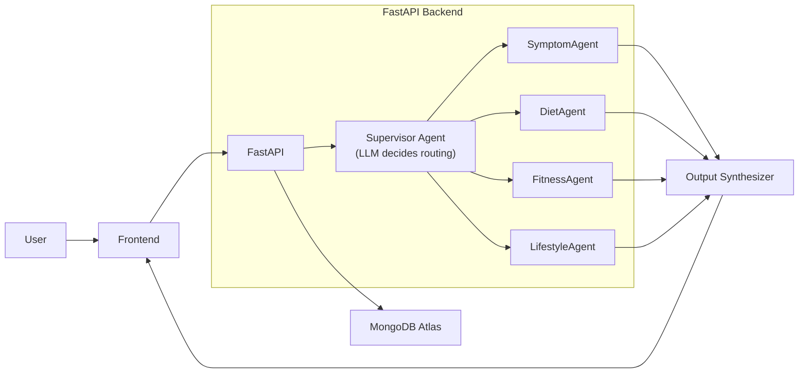

# Arogya — Multi-Agent Wellness Assistant (Backend)

> A supervisor LLM that dynamically routes health queries across 4 specialist AI agents — not a fixed pipeline, but context-aware orchestration that reads conversation history, user profile, and intermediate agent outputs before deciding what to run next.


🔗 **[Live Demo](https://digital-wellness-assistant.netlify.app/)** &nbsp;|&nbsp; **[Frontend Repo](https://github.com/Karthik-bhandarkar/agent-Frontend)** &nbsp;|&nbsp; **[Backend Repo](https://github.com/Karthik-bhandarkar/agent-backend)**

> ⚠️ **Cold start note:** The Render free tier spins down after inactivity. First request may take **30–50 seconds** to respond while the service wakes up. Subsequent requests are fast.

---

## Architecture



The **Supervisor Agent** is the core differentiator. Instead of routing queries through a hardcoded pipeline, it receives the user's message, their full profile (health metrics, goals, dietary preferences), and the current conversation history — then decides which specialist agent to invoke next, and repeats this loop up to 8 times until it determines the response is complete. Each agent's output is fed back into the supervisor's context window before the next step.

---

## Tech Stack

**AI & Orchestration**
- [FastAPI](https://fastapi.tiangolo.com/) — async REST API framework
- [LangChain 0.3.x](https://python.langchain.com/) — agent orchestration and chaining
- [Groq](https://groq.com/) — LLM inference engine (Llama-3.1-8B-Instant)

**Auth & Security**
- JWT (PyJWT) — stateless token authentication
- Passlib + bcrypt — password hashing

**Database**
- [MongoDB Atlas](https://www.mongodb.com/atlas) — cloud NoSQL database
- Motor — async MongoDB driver for Python

**Realtime**
- Server-Sent Events (SSE) via FastAPI's `StreamingResponse` — streams agent reasoning steps to the frontend in real-time as they happen

**Other**
- pypdf — PDF medical report text extraction
- python-dotenv — environment variable management
- Gunicorn + Uvicorn — production ASGI server (Render deployment)

---

## Features

- **Context-aware supervisor routing** — LLM reads full history + profile before each routing decision; not a static if/else pipeline
- **5 specialist agents** — Supervisor, Symptom, Diet, Fitness, Lifestyle — each with its own focused prompt and domain logic
- **Real-time streaming** — agent reasoning steps (which agent is running, why) are streamed to the frontend as SSE events before the final response arrives
- **6 modular API routers** — `auth`, `profile`, `chat`, `history`, `agent_stream`, `upload` — each in its own file for clean separation of concerns
- **JWT authentication** — signup, login, and bearer token protected routes
- **PDF medical report upload** — extracts text from uploaded PDF reports using pypdf and persists it into the user's profile for the agents to reference
- **Persistent conversation history** — each turn is stored in MongoDB with timestamp, agents used, and full response for the `/history` endpoint
- **Health check endpoint** — `/health` returns `{"status": "healthy"}` for Render uptime monitoring

---

## API Reference

| Router | Method | Path | Purpose |
|--------|--------|------|---------|
| `auth` | POST | `/auth/signup` | Register a new user |
| `auth` | POST | `/auth/login` | Login and receive JWT token |
| `profile` | GET/POST | `/profile/{user_id}` | Read or update user health profile |
| `chat` | POST | `/chat` | Send a message, receive full response |
| `agent_stream` | GET | `/agent-stream` | SSE stream of real-time agent reasoning |
| `history` | GET | `/history/{user_id}` | Fetch conversation history |
| `upload` | POST | `/upload/report` | Upload and parse a PDF medical report |

> **Interactive API docs** are auto-generated by FastAPI. When the server is running, visit [`/docs`](https://agent-backend-t11g.onrender.com/docs) for the full Swagger UI.

---

## Local Setup

### Prerequisites
- Python 3.10+
- A [MongoDB Atlas](https://www.mongodb.com/atlas) cluster (free tier works)
- A [Groq API key](https://console.groq.com) (free tier available)

### Steps

**1. Clone and install dependencies:**
```bash
git clone https://github.com/Karthik-bhandarkar/agent-backend.git
cd agent-backend
pip install -r requirements.txt
```

**2. Create your `.env` file** (copy from the example):
```bash
cp .env.example .env
```
Then fill in your actual values. Required variables:

| Variable | Description |
|----------|-------------|
| `MONGODB_URI` | Full MongoDB Atlas connection string (includes username + password) |
| `GROQ_API_KEY` | Your Groq API key (starts with `gsk_`) |
| `JWT_SECRET_KEY` | Any long random string — used to sign auth tokens |
| `GOOGLE_CLIENT_ID` | Google OAuth Client ID (optional — OAuth not yet active in prod) |
| `GOOGLE_CLIENT_SECRET` | Google OAuth Client Secret (optional) |
| `FRONTEND_BASE_URL` | `http://localhost:5173` for local dev |

**3. Run the development server:**
```bash
uvicorn main:app --reload --port 8000
```

API will be live at `http://localhost:8000`. Swagger docs at `http://localhost:8000/docs`.

---

## Deployment (Render)

This project includes a `render.yaml` blueprint for one-click Render deployment.

1. Push this repo to GitHub
2. Go to [Render Dashboard](https://dashboard.render.com) → **New +** → **Blueprint**
3. Connect your GitHub repository — Render detects `render.yaml` automatically
4. In the **Environment** tab, add these secrets:
   - `GROQ_API_KEY`
   - `MONGODB_URI`
   - `JWT_SECRET_KEY`
5. Click **Deploy** — your backend will be live at a `*.onrender.com` URL

---

## Engineering Highlights

### Supervisor-Driven Routing (Not a Fixed Pipeline)

Most LLM chat apps chain agents in a fixed order. Arogya's supervisor agent re-evaluates the situation after every agent run — it gets the updated state (what's been answered so far, what the user actually asked, what the profile says) and decides the next move. This means a query about knee pain might invoke SymptomAgent first, then skip Diet entirely and go directly to Fitness based on the profile — or it might chain all four if the context warrants it. The loop runs up to 8 steps with a hard cap to prevent runaway calls.

### Production Debugging via Live Benchmarking

During post-deployment testing using `latency_benchmark.py` (15 labeled test queries against the live Groq API), a routing issue was identified and traced to the supervisor's JSON output parser — the LLM was producing correct reasoning in its text, but wrapping the JSON decision in verbose prose that the parser failed to extract cleanly. This was caught by comparing the LLM's written reasoning (which was correct in 4/5 tested cases) against the parsed routing decision (which was not). The fix is a regex fallback or stricter JSON-only output enforcement in the supervisor prompt — tracked in the roadmap below.

---

## Roadmap

- [ ] **Fix supervisor JSON parsing** — add regex fallback to extract `{"next_agent": "..."}` even when the LLM wraps it in verbose text
- [ ] **Wire Google OAuth** — `routers/google_auth.py` is fully implemented but not yet registered in `main.py`; one import away from being active
- [ ] **Harden JWT config** — move `JWT_SECRET` fully to env-based config (currently falls back to a hardcoded placeholder in `config.py`)
- [ ] **Re-run full benchmark** — run all 15 queries post-fix and publish routing accuracy and latency numbers
- [ ] **Rate limiting** — add per-user request throttling on the agent_stream endpoint

---

## License

MIT — see [LICENSE](LICENSE) for details.
